# 📚 TÀI LIỆU THIẾT KẾ CƠ SỞ DỮ LIỆU (DATABASE SCHEMA DESIGN)
> **Dự án**: Hệ thống Quản lý Thực tập sinh (Internship Management System)  
> **Mục đích**: Tài liệu chuẩn hóa cấu trúc dữ liệu, quan hệ thực thể và ánh xạ Product Backlog cho lập trình viên và AI Agent tra cứu, phát triển API và xây dựng Models.

---

## 1. SƠ ĐỒ THỰC THỂ QUAN HỆ (ERD - ENTITY RELATIONSHIP DIAGRAM)

```mermaid
erDiagram
    TRUONG_DAI_HOC ||--o{ HO_SO_THUC_TAP : "da_dao_tao"
    PHONG_BAN ||--o{ CHUONG_TRINH_THUC_TAP : "quan_ly"
    PHONG_BAN ||--o{ NGUOI_DUNG : "thuoc"
    NGUOI_DUNG ||--o| HO_SO_THUC_TAP : "la_thuc_tap_sinh"
    NGUOI_DUNG ||--o{ HO_SO_THUC_TAP : "la_mentor_huong_dan"
    NGUOI_DUNG ||--o{ THONG_BAO : "nhan"
    NGUOI_DUNG ||--o{ NHAT_KY_HE_THONG : "thuc_hien"
    CHUONG_TRINH_THUC_TAP ||--o{ HO_SO_THUC_TAP : "thuoc_khoa"
    HO_SO_THUC_TAP ||--o{ TAI_LIEU_HO_SO : "co"
    HO_SO_THUC_TAP ||--o{ HOP_DONG : "ky_ket"
    HO_SO_THUC_TAP ||--o{ NHIEM_VU : "thuc_hien"
    HO_SO_THUC_TAP ||--o{ BAO_CAO_TUAN : "nop"
    HO_SO_THUC_TAP ||--o{ DANH_GIA : "duoc_danh_gia"
    HO_SO_THUC_TAP ||--o{ CHAM_CONG : "ghi_nhan"
    HO_SO_THUC_TAP ||--o{ DON_NGHI_PHEP : "xin_nghi"
    HO_SO_THUC_TAP ||--o{ PHU_CAP : "nhan_hang_thang"
    HO_SO_THUC_TAP ||--o{ YEU_CAU_HO_TRO : "gui"

    NGUOI_DUNG {
        int ma_nguoi_dung PK
        int ma_phong_ban FK
        string ho_ten
        string email
        string so_dien_thoai
        string vai_tro "Admin, HR, Mentor, ThucTapSinh"
        string trang_thai "HoatDong, Khoa"
    }

    TRUONG_DAI_HOC {
        int ma_truong PK
        string ten_truong
        string dia_chi
        string nguoi_lien_he
        string email_lien_he
    }

    PHONG_BAN {
        int ma_phong_ban PK
        string ten_phong_ban
        string mo_ta
    }

    CHUONG_TRINH_THUC_TAP {
        int ma_chuong_trinh PK
        int ma_phong_ban FK
        string ten_chuong_trinh
        date ngay_bat_dau
        date ngay_ket_thuc
        string mo_ta
    }

    HO_SO_THUC_TAP {
        int ma_ho_so PK
        int ma_nguoi_dung FK "Thực tập sinh"
        int ma_truong FK
        int ma_chuong_trinh FK
        int ma_mentor FK "Mentor hướng dẫn"
        string chuyen_nganh
        string trang_thai_xet_duyet "ChoDuyet, DaDuyet, TuChoi"
        string trang_thai_thuc_tap "DangThucTap, HoanThanh, ThoiHoc"
    }

    TAI_LIEU_HO_SO {
        int ma_tai_lieu PK
        int ma_ho_so FK
        string loai_tai_lieu "CV, DonXinThucTap, GiayGioiThieu"
        string duong_dan_file
        string trang_thai_duyet "ChoDuyet, DaDuyet, TuChoi"
    }

    HOP_DONG {
        int ma_hop_dong PK
        int ma_ho_so FK
        string duong_dan_file
        date ngay_tai_len
        date ngay_ky
        string trang_thai "ChuaXacNhan, DaXacNhan"
    }

    NHIEM_VU {
        int ma_nhiem_vu PK
        int ma_ho_so FK
        string ten_nhiem_vu
        string mo_ta
        date han_hoan_thanh
        int tien_do_phantram
        string trang_thai "Moi, DangThucHien, HoanThanh"
    }

    BAO_CAO_TUAN {
        int ma_bao_cao PK
        int ma_ho_so FK
        int tuan_so
        string noi_dung_cong_viec
        string ket_qua_dat_duoc
        string phan_hoi_mentor
        datetime thoi_gian_nop
    }

    DANH_GIA {
        int ma_danh_gia PK
        int ma_ho_so FK
        int ma_nguoi_danh_gia FK
        string loai_danh_gia "GiuaKy, CuoiKy"
        float diem_ky_nang
        float diem_thai_do
        string nhan_xet_chi_tiet
        boolean de_xuat_tuyen_chinh_thuc
    }

    CHAM_CONG {
        int ma_cham_cong PK
        int ma_ho_so FK
        date ngay_cham_cong
        time gio_check_in
        time gio_check_out
        string phuong_thuc "QR, The, Web"
    }

    DON_NGHI_PHEP {
        int ma_don PK
        int ma_ho_so FK
        date ngay_nghi
        string ly_do
        string trang_thai "ChoDuyet, DaDuyet, TuChoi"
    }

    PHU_CAP {
        int ma_phu_cap PK
        int ma_ho_so FK
        string thang_nam
        decimal so_tien
        string trang_thai_chi_tra "DaChiTra, ChuaChiTra"
    }

    YEU_CAU_HO_TRO {
        int ma_yeu_cau PK
        int ma_ho_so FK
        string loai_yeu_cau "XinChungNhan, GiayXacNhan, Khac"
        string noi_dung
        string phan_hoi_hr
        string trang_thai "ChoXuLy, DaXuLy"
    }

    THONG_BAO {
        int ma_thong_bao PK
        int ma_nguoi_dung FK
        string tieu_de
        string noi_dung
        string kenh "Email, App"
        boolean da_doc
        datetime thoi_gian_gui
    }

    NHAT_KY_HE_THONG {
        int ma_nhat_ky PK
        int ma_nguoi_dung FK
        string hanh_dong
        string dia_chi_ip
        datetime thoi_gian
    }
```

---

## 2. CHI TIẾT CÁC THỰC THỂ (ENTITIES SPECIFICATION)

### 2.1. NGUOI_DUNG (Tài khoản người dùng)
*Quản lý thông tin tài khoản, danh tính và phân quyền trong hệ thống.*

| Tên cột | Kiểu dữ liệu | Khóa | Ràng buộc / Giá trị cho phép | Mô tả |
| :--- | :--- | :--- | :--- | :--- |
| `ma_nguoi_dung` | `INT` | **PK** | `AUTO_INCREMENT` | Mã định danh người dùng |
| `ma_phong_ban` | `INT` | **FK** | `NULL` được (cho TTS chưa gán phòng ban) | Liên kết tới `PHONG_BAN(ma_phong_ban)` |
| `ho_ten` | `VARCHAR(100)` | | `NOT NULL` | Họ và tên |
| `email` | `VARCHAR(100)` | | `NOT NULL, UNIQUE` | Địa chỉ email đăng nhập / liên hệ |
| `so_dien_thoai` | `VARCHAR(20)` | | `NULL, UNIQUE` | Số điện thoại liên lạc |
| `vai_tro` | `VARCHAR(50)` | | `Admin`, `HR`, `Mentor`, `ThucTapSinh` | Quyền hạn tài khoản trong hệ thống |
| `trang_thai` | `VARCHAR(50)` | | `HoatDong`, `Khoa` | Trạng thái kích hoạt tài khoản |

---

### 2.2. TRUONG_DAI_HOC (Danh mục Trường Đại học)
*Quản lý danh sách các cơ sở giáo dục đối tác cung cấp nguồn ứng viên.*

| Tên cột | Kiểu dữ liệu | Khóa | Ràng buộc / Giá trị cho phép | Mô tả |
| :--- | :--- | :--- | :--- | :--- |
| `ma_truong` | `INT` | **PK** | `AUTO_INCREMENT` | Mã định danh trường |
| `ten_truong` | `VARCHAR(200)` | | `NOT NULL` | Tên trường đại học / cao đẳng |
| `dia_chi` | `VARCHAR(255)` | | `NULL` | Địa chỉ trụ sở trường |
| `nguoi_lien_he` | `VARCHAR(100)` | | `NULL` | Cán bộ phụ trách liên kết |
| `email_lien_he` | `VARCHAR(100)` | | `NULL` | Email cán bộ liên hệ |

---

### 2.3. PHONG_BAN (Phòng ban công ty)
*Cơ cấu phòng ban nội bộ tiếp nhận và quản lý các đợt thực tập.*

| Tên cột | Kiểu dữ liệu | Khóa | Ràng buộc / Giá trị cho phép | Mô tả |
| :--- | :--- | :--- | :--- | :--- |
| `ma_phong_ban` | `INT` | **PK** | `AUTO_INCREMENT` | Mã định danh phòng ban |
| `ten_phong_ban` | `VARCHAR(100)` | | `NOT NULL` | Tên phòng ban (VD: IT, Marketing, Kế toán) |
| `mo_ta` | `VARCHAR(255)` | | `NULL` | Mô tả chức năng nhiệm vụ phòng ban |

---

### 2.4. CHUONG_TRINH_THUC_TAP (Đợt / Khóa thực tập)
*Các chiến dịch / khóa đào tạo thực tập sinh theo từng đợt của công ty.*

| Tên cột | Kiểu dữ liệu | Khóa | Ràng buộc / Giá trị cho phép | Mô tả |
| :--- | :--- | :--- | :--- | :--- |
| `ma_chuong_trinh` | `INT` | **PK** | `AUTO_INCREMENT` | Mã định danh chương trình |
| `ma_phong_ban` | `INT` | **FK** | `NOT NULL` | Thuộc phòng ban quản lý (`PHONG_BAN`) |
| `ten_chuong_trinh`| `VARCHAR(150)` | | `NOT NULL` | Tên chương trình (VD: Khóa thực tập Hè 2026) |
| `ngay_bat_dau` | `DATE` | | `NOT NULL` | Ngày bắt đầu chương trình |
| `ngay_ket_thuc` | `DATE` | | `NOT NULL` (>= `ngay_bat_dau`) | Ngày bế mạc chương trình |
| `mo_ta` | `TEXT` | | `NULL` | Mô tả yêu cầu, chỉ tiêu tuyển sinh |

---

### 2.5. HO_SO_THUC_TAP (Hồ sơ thực tập - Thực thể Trung tâm)
*Lưu vết toàn bộ quá trình thực tập của thực tập sinh, nối kết Mentor, Trường, Chương trình.*

| Tên cột | Kiểu dữ liệu | Khóa | Ràng buộc / Giá trị cho phép | Mô tả |
| :--- | :--- | :--- | :--- | :--- |
| `ma_ho_so` | `INT` | **PK** | `AUTO_INCREMENT` | Mã định danh hồ sơ thực tập |
| `ma_nguoi_dung` | `INT` | **FK** | `NOT NULL` | Người dùng là thực tập sinh (`NGUOI_DUNG`) |
| `ma_truong` | `INT` | **FK** | `NULL` | Trường đại học của thực tập sinh (`TRUONG_DAI_HOC`) |
| `ma_chuong_trinh`| `INT` | **FK** | `NULL` | Thuộc đợt thực tập nào (`CHUONG_TRINH_THUC_TAP`) |
| `ma_mentor` | `INT` | **FK** | `NULL` | Cán bộ hướng dẫn (`NGUOI_DUNG` có vai trò Mentor) |
| `chuyen_nganh` | `VARCHAR(100)` | | `NULL` | Chuyên ngành học tập |
| `trang_thai_xet_duyet` | `VARCHAR(50)` | | `ChoDuyet`, `DaDuyet`, `TuChoi` | Tiến trình xét duyệt ứng tuyển |
| `trang_thai_thuc_tap` | `VARCHAR(50)` | | `DangThucTap`, `HoanThanh`, `ThoiHoc` | Tiến độ đào tạo thực tế |

---

### 2.6. TAI_LIEU_HO_SO (Tài liệu đính kèm)
*Quản lý CV, đơn xin thực tập, giấy giới thiệu của sinh viên.*

| Tên cột | Kiểu dữ liệu | Khóa | Ràng buộc / Giá trị cho phép | Mô tả |
| :--- | :--- | :--- | :--- | :--- |
| `ma_tai_lieu` | `INT` | **PK** | `AUTO_INCREMENT` | Mã định danh tài liệu |
| `ma_ho_so` | `INT` | **FK** | `NOT NULL` | Thuộc hồ sơ thực tập (`HO_SO_THUC_TAP`) |
| `loai_tai_lieu` | `VARCHAR(50)` | | `CV`, `DonXinThucTap`, `GiayGioiThieu` | Loại tài liệu nộp |
| `duong_dan_file`| `VARCHAR(255)` | | `NOT NULL` | Đường dẫn lưu trữ tệp (URL / Local Path) |
| `trang_thai_duyet` | `VARCHAR(50)` | | `ChoDuyet`, `DaDuyet`, `TuChoi` | HR xác nhận duyệt tài liệu |

---

### 2.7. HOP_DONG (Hợp đồng thực tập)
*Theo dõi hợp đồng pháp lý ký kết giữa công ty và thực tập sinh.*

| Tên cột | Kiểu dữ liệu | Khóa | Ràng buộc / Giá trị cho phép | Mô tả |
| :--- | :--- | :--- | :--- | :--- |
| `ma_hop_dong` | `INT` | **PK** | `AUTO_INCREMENT` | Mã định danh hợp đồng |
| `ma_ho_so` | `INT` | **FK** | `NOT NULL` | Gắn với hồ sơ (`HO_SO_THUC_TAP`) |
| `duong_dan_file`| `VARCHAR(255)` | | `NOT NULL` | Tệp scan / file hợp đồng điện tử |
| `ngay_tai_len` | `DATE` | | `DEFAULT CURRENT_DATE` | Ngày tải lên hệ thống |
| `ngay_ky` | `DATE` | | `NULL` | Ngày thực tế đôi bên ký |
| `trang_thai` | `VARCHAR(50)` | | `ChuaXacNhan`, `DaXacNhan` | Tình trạng xác nhận hợp đồng |

---

### 2.8. NHIEM_VU (Nhiệm vụ / Task công việc)
*Phân công công việc và theo dõi tiến độ từng thực tập sinh.*

| Tên cột | Kiểu dữ liệu | Khóa | Ràng buộc / Giá trị cho phép | Mô tả |
| :--- | :--- | :--- | :--- | :--- |
| `ma_nhiem_vu` | `INT` | **PK** | `AUTO_INCREMENT` | Mã định danh nhiệm vụ |
| `ma_ho_so` | `INT` | **FK** | `NOT NULL` | Giao cho hồ sơ (`HO_SO_THUC_TAP`) |
| `ten_nhiem_vu` | `VARCHAR(150)` | | `NOT NULL` | Tiêu đề nhiệm vụ |
| `mo_ta` | `TEXT` | | `NULL` | Chi tiết công việc cần làm |
| `han_hoan_thanh`| `DATE` | | `NOT NULL` | Hạn chót (Deadline) |
| `tien_do_phantram`| `INT` | | `DEFAULT 0` (0 - 100) | Tiến độ hoàn thành (%) |
| `trang_thai` | `VARCHAR(50)` | | `Moi`, `DangThucHien`, `HoanThanh` | Trạng thái xử lý |

---

### 2.9. BAO_CAO_TUAN (Báo cáo định kỳ tuần)
*Báo cáo công việc hàng tuần của sinh viên gửi tới Mentor phản hồi.*

| Tên cột | Kiểu dữ liệu | Khóa | Ràng buộc / Giá trị cho phép | Mô tả |
| :--- | :--- | :--- | :--- | :--- |
| `ma_bao_cao` | `INT` | **PK** | `AUTO_INCREMENT` | Mã định danh báo cáo |
| `ma_ho_so` | `INT` | **FK** | `NOT NULL` | Báo cáo thuộc hồ sơ (`HO_SO_THUC_TAP`) |
| `tuan_so` | `INT` | | `NOT NULL` (>= 1) | Số thứ tự tuần thực tập |
| `noi_dung_cong_viec`| `TEXT` | | `NOT NULL` | Việc đã thực hiện trong tuần |
| `ket_qua_dat_duoc` | `TEXT` | | `NULL` | Kết quả/sản phẩm đạt được |
| `phan_hoi_mentor` | `TEXT` | | `NULL` | Nhận xét, hướng dẫn từ Mentor |
| `thoi_gian_nop` | `DATETIME` | | `DEFAULT CURRENT_TIMESTAMP` | Thời điểm nộp báo cáo |

---

### 2.10. DANH_GIA (Đánh giá năng lực)
*Đánh giá kết quả rèn luyện giữa kỳ / cuối kỳ của thực tập sinh.*

| Tên cột | Kiểu dữ liệu | Khóa | Ràng buộc / Giá trị cho phép | Mô tả |
| :--- | :--- | :--- | :--- | :--- |
| `ma_danh_gia` | `INT` | **PK** | `AUTO_INCREMENT` | Mã định danh bản đánh giá |
| `ma_ho_so` | `INT` | **FK** | `NOT NULL` | Hồ sơ được đánh giá (`HO_SO_THUC_TAP`) |
| `ma_nguoi_danh_gia`| `INT` | **FK** | `NOT NULL` | Mentor hoặc HR đánh giá (`NGUOI_DUNG`) |
| `loai_danh_gia` | `VARCHAR(50)` | | `GiuaKy`, `CuoiKy` | Phân loại mốc đánh giá |
| `diem_ky_nang` | `FLOAT` | | `0.0 - 10.0` | Thang điểm chuyên môn kỹ năng |
| `diem_thai_do` | `FLOAT` | | `0.0 - 10.0` | Thang điểm thái độ kỷ luật |
| `nhan_xet_chi_tiet`| `TEXT` | | `NULL` | Lời nhận xét chi tiết |
| `de_xuat_tuyen_chinh_thuc`| `BOOLEAN` | | `DEFAULT FALSE` | Đề xuất tuyển dụng làm nhân viên chính thức |

---

### 2.11. CHAM_CONG (Nhật ký chấm công hàng ngày)
*Lưu vết giờ đến, giờ về của thực tập sinh.*

| Tên cột | Kiểu dữ liệu | Khóa | Ràng buộc / Giá trị cho phép | Mô tả |
| :--- | :--- | :--- | :--- | :--- |
| `ma_cham_cong` | `INT` | **PK** | `AUTO_INCREMENT` | Mã bản ghi chấm công |
| `ma_ho_so` | `INT` | **FK** | `NOT NULL` | Chấm công cho hồ sơ (`HO_SO_THUC_TAP`) |
| `ngay_cham_cong` | `DATE` | | `NOT NULL` | Ngày làm việc |
| `gio_check_in` | `TIME` | | `NULL` | Giờ vào làm |
| `gio_check_out` | `TIME` | | `NULL` | Giờ tan làm |
| `phuong_thuc` | `VARCHAR(50)` | | `QR`, `The`, `Web` | Phương thức điểm danh |

---

### 2.12. DON_NGHI_PHEP (Đơn xin nghỉ phép)
*Quản lý yêu cầu xin vắng mặt của sinh viên.*

| Tên cột | Kiểu dữ liệu | Khóa | Ràng buộc / Giá trị cho phép | Mô tả |
| :--- | :--- | :--- | :--- | :--- |
| `ma_don` | `INT` | **PK** | `AUTO_INCREMENT` | Mã đơn nghỉ |
| `ma_ho_so` | `INT` | **FK** | `NOT NULL` | Người làm đơn (`HO_SO_THUC_TAP`) |
| `ngay_nghi` | `DATE` | | `NOT NULL` | Ngày đăng ký nghỉ |
| `ly_do` | `VARCHAR(255)` | | `NOT NULL` | Lý do xin phép |
| `trang_thai` | `VARCHAR(50)` | | `ChoDuyet`, `DaDuyet`, `TuChoi` | Quyết định của Mentor / HR |

---

### 2.13. PHU_CAP (Phụ cấp thực tập hàng tháng)
*Ghi nhận chính sách hỗ trợ tài chính cho sinh viên.*

| Tên cột | Kiểu dữ liệu | Khóa | Ràng buộc / Giá trị cho phép | Mô tả |
| :--- | :--- | :--- | :--- | :--- |
| `ma_phu_cap` | `INT` | **PK** | `AUTO_INCREMENT` | Mã bản ghi phụ cấp |
| `ma_ho_so` | `INT` | **FK** | `NOT NULL` | Hồ sơ nhận phụ cấp (`HO_SO_THUC_TAP`) |
| `thang_nam` | `VARCHAR(7)` | | Định dạng `YYYY-MM` (VD: `2026-09`) | Kỳ chi trả |
| `so_tien` | `DECIMAL(12,2)` | | `>= 0` | Số tiền phụ cấp (VND) |
| `trang_thai_chi_tra`| `VARCHAR(50)`| | `DaChiTra`, `ChuaChiTra` | Tình trạng kế toán thanh toán |

---

### 2.14. YEU_CAU_HO_TRO (Yêu cầu hỗ trợ sinh viên)
*Kênh xử lý các thủ tục cấp giấy tờ hành chính cho sinh viên.*

| Tên cột | Kiểu dữ liệu | Khóa | Ràng buộc / Giá trị cho phép | Mô tả |
| :--- | :--- | :--- | :--- | :--- |
| `ma_yeu_cau` | `INT` | **PK** | `AUTO_INCREMENT` | Mã yêu cầu hỗ trợ |
| `ma_ho_so` | `INT` | **FK** | `NOT NULL` | Hồ sơ gửi yêu cầu (`HO_SO_THUC_TAP`) |
| `loai_yeu_cau` | `VARCHAR(50)` | | `XinChungNhan`, `GiayXacNhan`, `Khac` | Phân loại đề xuất |
| `noi_dung` | `TEXT` | | `NOT NULL` | Chi tiết nội dung cần hỗ trợ |
| `phan_hoi_hr` | `TEXT` | | `NULL` | Trả lời / hướng dẫn từ HR |
| `trang_thai` | `VARCHAR(50)` | | `ChoXuLy`, `DaXuLy` | Tiến độ xử lý |

---

### 2.15. THONG_BAO (Thông báo gửi người dùng)
*Hộp thư và hệ thống thông báo đẩy tự động.*

| Tên cột | Kiểu dữ liệu | Khóa | Ràng buộc / Giá trị cho phép | Mô tả |
| :--- | :--- | :--- | :--- | :--- |
| `ma_thong_bao` | `INT` | **PK** | `AUTO_INCREMENT` | Mã thông báo |
| `ma_nguoi_dung` | `INT` | **FK** | `NOT NULL` | Người nhận (`NGUOI_DUNG`) |
| `tieu_de` | `VARCHAR(200)` | | `NOT NULL` | Tiêu đề thông báo |
| `noi_dung` | `TEXT` | | `NOT NULL` | Nội dung chi tiết |
| `kenh` | `VARCHAR(50)` | | `Email`, `App` | Phương thức gửi thông báo |
| `da_doc` | `BOOLEAN` | | `DEFAULT FALSE` | Đánh dấu đã xem |
| `thoi_gian_gui` | `DATETIME` | | `DEFAULT CURRENT_TIMESTAMP` | Thời điểm gửi |

---

### 2.16. NHAT_KY_HE_THONG (Audit Log hệ thống)
*Ghi vết toàn bộ hành vi quan trọng của người dùng vì mục đích bảo mật.*

| Tên cột | Kiểu dữ liệu | Khóa | Ràng buộc / Giá trị cho phép | Mô tả |
| :--- | :--- | :--- | :--- | :--- |
| `ma_nhat_ky` | `INT` | **PK** | `AUTO_INCREMENT` | Mã bản ghi log |
| `ma_nguoi_dung` | `INT` | **FK** | `NULL` (nếu hành động trước đăng nhập) | Người thực hiện (`NGUOI_DUNG`) |
| `hanh_dong` | `VARCHAR(255)` | | `NOT NULL` | Mô tả thao tác (VD: "Đăng nhập", "Sửa điểm") |
| `dia_chi_ip` | `VARCHAR(45)` | | `NULL` | Địa chỉ IP gửi request (IPv4/IPv6) |
| `thoi_gian` | `DATETIME` | | `DEFAULT CURRENT_TIMESTAMP` | Thời điểm ghi nhận |

---

## 3. BẢNG TỔNG HỢP MỐI QUAN HỆ (RELATIONSHIPS MATRIX)

| Thực thể nguồn (Bảng cha) | Quan hệ | Thực thể đích (Bảng con) | Khóa ngoại (Foreign Key) | Ý nghĩa nghiệp vụ |
| :--- | :---: | :--- | :--- | :--- |
| `TRUONG_DAI_HOC` | 1 - N | `HO_SO_THUC_TAP` | `HO_SO_THUC_TAP.ma_truong` | Một trường đào tạo nhiều thực tập sinh |
| `PHONG_BAN` | 1 - N | `CHUONG_TRINH_THUC_TAP` | `CHUONG_TRINH_THUC_TAP.ma_phong_ban` | Một phòng ban quản lý nhiều đợt thực tập |
| `PHONG_BAN` | 1 - N | `NGUOI_DUNG` | `NGUOI_DUNG.ma_phong_ban` | Người dùng (Mentor, HR) thuộc phòng ban |
| `NGUOI_DUNG` | 1 - 1 | `HO_SO_THUC_TAP` | `HO_SO_THUC_TAP.ma_nguoi_dung` | Mỗi tài khoản TTS có 1 hồ sơ thực tập tương ứng |
| `NGUOI_DUNG` (Mentor) | 1 - N | `HO_SO_THUC_TAP` | `HO_SO_THUC_TAP.ma_mentor` | Một Mentor hướng dẫn nhiều hồ sơ thực tập |
| `NGUOI_DUNG` | 1 - N | `THONG_BAO` | `THONG_BAO.ma_nguoi_dung` | Một người dùng nhận nhiều thông báo |
| `NGUOI_DUNG` | 1 - N | `NHAT_KY_HE_THONG` | `NHAT_KY_HE_THONG.ma_nguoi_dung` | Một người dùng tạo ra nhiều nhật ký hành động |
| `CHUONG_TRINH_THUC_TAP` | 1 - N | `HO_SO_THUC_TAP` | `HO_SO_THUC_TAP.ma_chuong_trinh` | Một chương trình có nhiều hồ sơ tham gia |
| `HO_SO_THUC_TAP` | 1 - N | `TAI_LIEU_HO_SO` | `TAI_LIEU_HO_SO.ma_ho_so` | Một hồ sơ có nhiều tài liệu (CV, đơn xin, ...) |
| `HO_SO_THUC_TAP` | 1 - N | `HOP_DONG` | `HOP_DONG.ma_ho_so` | Một hồ sơ có hợp đồng ký kết |
| `HO_SO_THUC_TAP` | 1 - N | `NHIEM_VU` | `NHIEM_VU.ma_ho_so` | Một hồ sơ được giao nhiều nhiệm vụ |
| `HO_SO_THUC_TAP` | 1 - N | `BAO_CAO_TUAN` | `BAO_CAO_TUAN.ma_ho_so` | Một hồ sơ nộp nhiều báo cáo tuần |
| `HO_SO_THUC_TAP` | 1 - N | `DANH_GIA` | `DANH_GIA.ma_ho_so` | Một hồ sơ có các đợt đánh giá giữa/cuối kỳ |
| `HO_SO_THUC_TAP` | 1 - N | `CHAM_CONG` | `CHAM_CONG.ma_ho_so` | Một hồ sơ có lịch sử chấm công từng ngày |
| `HO_SO_THUC_TAP` | 1 - N | `DON_NGHI_PHEP` | `DON_NGHI_PHEP.ma_ho_so` | Một hồ sơ nộp các đơn xin nghỉ phép |
| `HO_SO_THUC_TAP` | 1 - N | `PHU_CAP` | `PHU_CAP.ma_ho_so` | Một hồ sơ nhận phụ cấp từng tháng |
| `HO_SO_THUC_TAP` | 1 - N | `YEU_CAU_HO_TRO` | `YEU_CAU_HO_TRO.ma_ho_so` | Một hồ sơ gửi các yêu cầu xin xác nhận |

---

## 4. ÁNH XẠ THỰC THỂ TỚI USER STORIES (PRODUCT BACKLOG MAPPING)

| Thực thể (Entity) | Vai trò hệ thống & Ánh xạ tới User Stories | User Stories liên quan |
| :--- | :--- | :--- |
| **`NGUOI_DUNG`** | Quản lý thông tin tài khoản chung và phân quyền tài khoản (Admin, HR, Mentor, Thực tập sinh). | US 39, US 40 |
| **`TRUONG_DAI_HOC`** | Quản lý danh mục trường đại học để lọc, thống kê nguồn ứng viên và gửi báo cáo liên kết. | US 3, US 20, US 32, US 34 |
| **`PHONG_BAN`** | Quản lý cơ cấu phòng ban công ty để phân bổ thực tập sinh và mentor. | US 11, US 29, US 31 |
| **`CHUONG_TRINH_THUC_TAP`** | Quản lý đợt/chương trình thực tập, thời gian bắt đầu & kết thúc. | US 11, US 13 |
| **`HO_SO_THUC_TAP`** | **Thực thể trung tâm**: Lưu trữ chi tiết thông tin thực tập sinh, tiến độ, trạng thái xét duyệt, liên kết với Mentor và Trường đại học. | US 1, US 2, US 6, US 7, US 12, US 30, US 33 |
| **`TAI_LIEU_HO_SO`** | Lưu trữ CV, đơn thực tập và trạng thái duyệt tài liệu. | US 4, US 5 |
| **`HOP_DONG`** | Lưu trữ hợp đồng thực tập và trạng thái xác nhận trực tuyến. | US 9, US 10 |
| **`NHIEM_VU`** | Giao việc cho thực tập sinh, theo dõi tiến độ công việc. | US 15, US 16 |
| **`BAO_CAO_TUAN`** | Thực tập sinh nộp báo cáo tuần và Mentor xem/phản hồi. | US 17, US 18 |
| **`DANH_GIA`** | Ghi nhận điểm kỹ năng, thái độ, nhận xét cuối kỳ và tỷ lệ đề xuất tuyển chính thức. | US 19, US 20, US 33 |
| **`CHAM_CONG`** | Ghi nhận Check-in/Check-out qua Web/QR/Thẻ. | US 21, US 22, US 38 |
| **`DON_NGHI_PHEP`** | Tạo và quản lý yêu cầu xin nghỉ phép. | US 22, US 24 |
| **`PHU_CAP`** | Quản lý mức phụ cấp và lịch sử nhận tiền hàng tháng. | US 25, US 26 |
| **`YEU_CAU_HO_TRO`** | Xử lý các xin xác nhận/chứng nhận thực tập. | US 27, US 28 |
| **`THONG_BAO`** | Nhật ký gửi email/notification tự động đến người dùng. | US 8, US 35, US 36 |
| **`NHAT_KY_HE_THONG`** | Lưu thông tin thao tác và bảo mật cho Admin. | US 41, US 42 |

---

## 5. ĐỊNH HƯỚNG TÁI CẤU TRÚC (REFACTORING ROADMAP) CHO BƯỚC 2

> [!NOTE]
> Phần ghi chú kỹ thuật này chuẩn bị cho Bước 2 (Sửa lại API GET và PUT):

1. **Hiện trạng cũ (Bảng `interns`)**:
   - Chỉ có 1 bảng đơn lẻ: `id`, `full_name`, `email`, `phone`, `university`, `major`, `status`, `start_date`, `end_date`, `created_at`.
   - Các API `/api/interns/{id}` (GET, PUT) hiện đang thao tác trực tiếp trên bảng `interns` này.

2. **Mô hình mới tương ứng**:
   - Thông tin cá nhân (`ho_ten`, `email`, `so_dien_thoai`) thuộc về bảng **`NGUOI_DUNG`**.
   - Trường học thuộc về bảng **`TRUONG_DAI_HOC`** (hoặc `ma_truong` trong `HO_SO_THUC_TAP`).
   - Thời gian thực tập (`ngay_bat_dau`, `ngay_ket_thuc`) thuộc về **`CHUONG_TRINH_THUC_TAP`** hoặc kế thừa qua đợt.
   - Trạng thái thực tập (`DangThucTap`, `HoanThanh`, `ThoiHoc`) và chuyên ngành (`chuyen_nganh`) thuộc về **`HO_SO_THUC_TAP`**.
   - Khi thực hiện bước 2, ta sẽ xác định rõ chiến lược:
     - **Chiến lược A (Khuyến nghị chuyển đổi toàn diện)**: Cập nhật SQLAlchemy Models theo đúng các bảng mới (`User`, `InternshipProfile`, `University`,...), đồng thời sửa API `GET /api/interns/{id}` và `PUT /api/interns/{id}` để query join `HO_SO_THUC_TAP` với `NGUOI_DUNG` và các quan hệ liên quan.
     - **Chiến lược B (Adapter/View layer)**: Tạo DTO/Schema mapping giúp API bên ngoài giữ nguyên hợp đồng (contract) trong khi tầng database đã chuẩn hóa sang mô hình mới.
